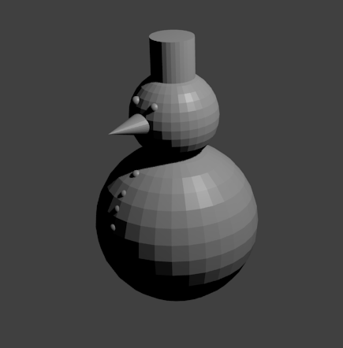
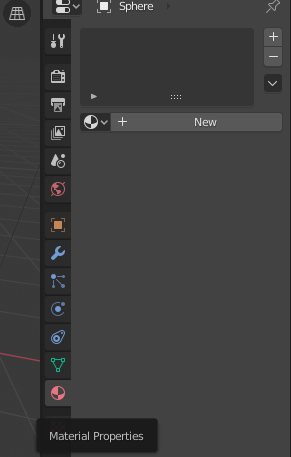
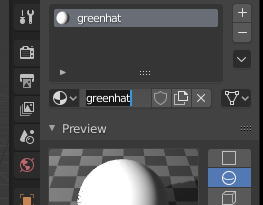
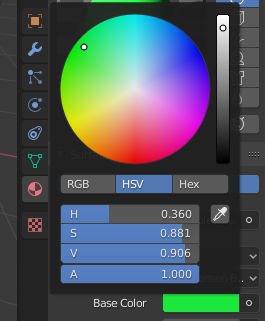
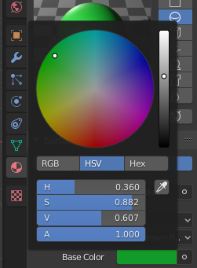
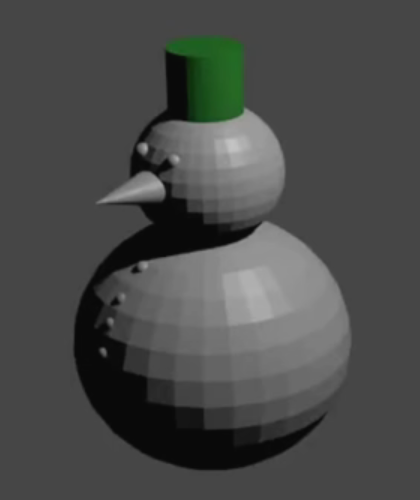
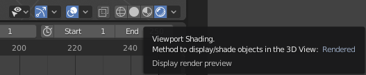

## Giv hatten farve

Du vil begynde med snemanden, som du lavede hvis du afsluttede [Snowman](https://projects.raspberrypi.org/en/projects/blender-snowman){:target="_blank"} ressourcen. Hvis du ikke har en snemand, kan du [downloade starterprojektet](resources/snowman.blend).

Snemanden har en hat på sit hoved. Lad os prøve at male den grøn.

+ Gengiv billedet ved at trykke <kbd>F12</kbd> (eller <kbd>FN + F12</kbd> hvis du bruger en Mac).

Hvis du kigger på billedet, kan du se at snemanden er helt grå:

For at farve snemanden, skal du tilføje **materialer** til modellen.

+ Tryk <kbd>ESC</kbd> for at forlade gengivelsesvisning.

+ Vælg hatten og tryk **Material Properties** ikonet i menuen på panelet til højre.

+ Tilføj et nyt materiale ved at trykke på **New** knappen.

+ Giv materialet navnet 'greenhat' (engelsk for grøn hat) ved at skrive navnet i boksen.

+ Gå til **Base Color** under dette og klik på den hvide boks. En farvepalet vil dukke op, hvor du kan vælge en dejlig grøn farve.

De farver, du kan vælge imellem, er måske for lyse til din smag. Hvis du ønsker at bruge en mørkere grøn, kan du reducere farveintensiteten.

+ Vælg **Base Color** igen ved at klikke den farvede boks. Træk prikken i den højre bar ned mod den sorte farve. Du vil se, at den grønne farve bliver mørkere.

+ Gengiv dit billede for at se, hvordan modellen ser ud nu.

Du kan se, at snemanden nu har en grøn hat.

+ Forlad gengivelsesvisning.

+ For at se farven på snemanden i 3D visning, tryk på **Viewport Shading** knappen.

