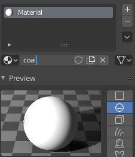
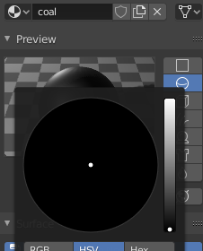
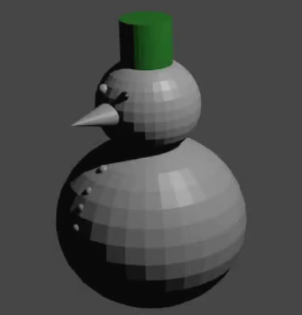

## Giv et øje farve

I dette trin vil du farve et øje.

+ Vælg et af øjnene ved at klikke på det. Du kan sikre, at øjet er valgt ved at checke, om der er en orange kant omkring det.

+ Ligesom du gjorde med hatten, skal du gå til **Material Properties** fanen i panelet til venstre og trykke **New** for at lave et nyt materiale til øjet.

+ Navngiv dette materiale 'coal' (engelsk for kul).

+ Vælg **Base Color** under dette. Bemærk at der ikke er nogen sort på farvepaletten! Du kan dog reducere farveintensiteten ved at flytte prikken til højre ned, indtil du når sort.

Nu har du et sort øje. Resten af snemanden er stadig grå.

+ Gengiv billedet for at se, hvordan modellen ser ud nu.

+ Tryk <kbd>ESC</kbd> for at forlade gengivelsesvisning igen.
