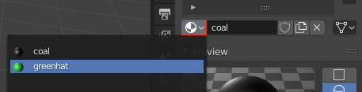
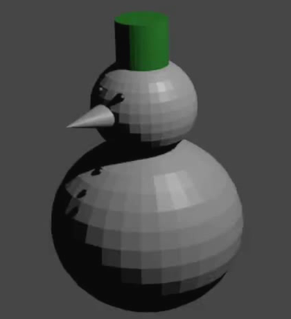

## Giv øjnene og knapperne farve

For at farve det andet øje og hver enkelte knap, kunne du gå igennem hele processen med at tilføje nye materialer for hver enkelte, men dette ville være ret besværligt. Det er meget lettere at genbruge et materiale du allerede har lavet, så lad os genbruge kulmaterialet til af farve det andet øje og knapperne!

+ Vælg det andet øje.

+ Gå til **Material Properties** fanen. I stedet for at vælge **New** indstillingen, så tryk **material selection** rullemenuen ved siden af.

+ Vælg 'coal' materialet du oprettede tidligere.

Gentag denne process for hver af snemandens knapper.

+ Vælg en knap, og derefter klik **Material Properties** fanen for at vælge 'coal' materialet.

+ Gengiv dit billede igen. Du vil se, at snemanden nu har sorte knapper og sorte øjne.

