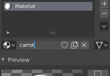
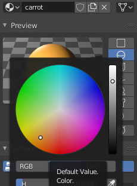
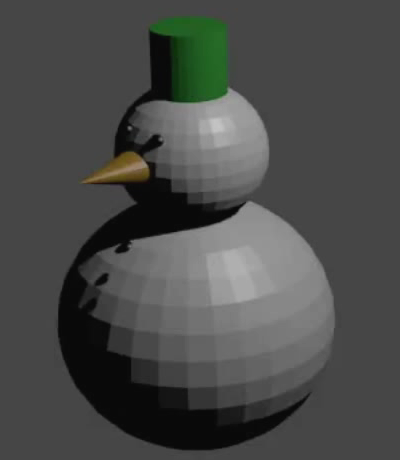

## Giv næsen farve

Snemandens næse vil være orange. Eftersom du ikke har et orange materiale, bliver du nødt til at lave en ny farve.

+ Vælg næsen.

+ Gå til **Material Properties** fanen.

+ Vælg **New** for at lave en ny farve.

+ Giv materialet et navn, som for eksempel 'carrot' (engelsk for gulerod).

+ Tryk **Base Color** og vælg en fin orange farve. Hvis det er nødvendigt, kan du reducere farveintensiteten for at få en dejlig gulerodsagtig farve.

+ Gengiv dit billede for at checke, at næsen har en dejlig orange farve.

+ Forlad gengivelsesvisning igen.
