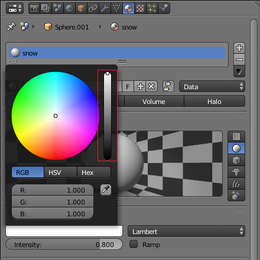
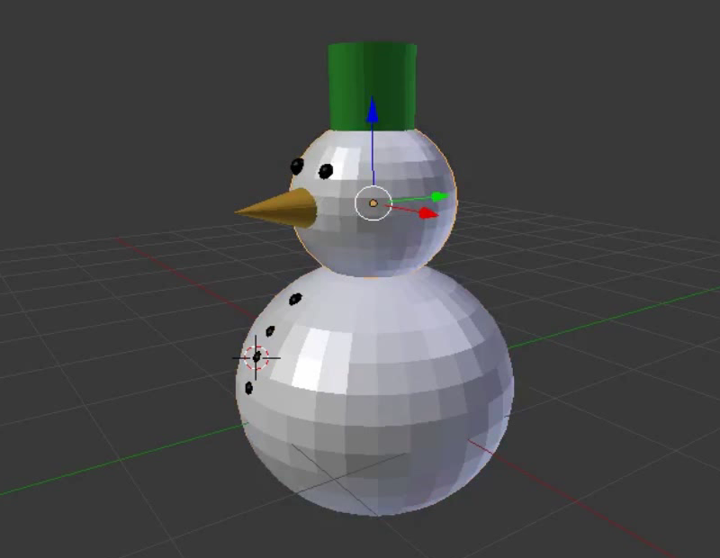

## Udfordring: giv kroppen farve

Når du er i 3D visning, vil du bemærke, at kuglerne, som snemandens krop og hoved er lavet af, er grå og ikke hvide.

+ Prøv at bruge, hvad du har lært, til at farve snemandens hoved og krop hvid.

For at lave den hvide farve, skal du trække prikken i baren hele vejen op.

