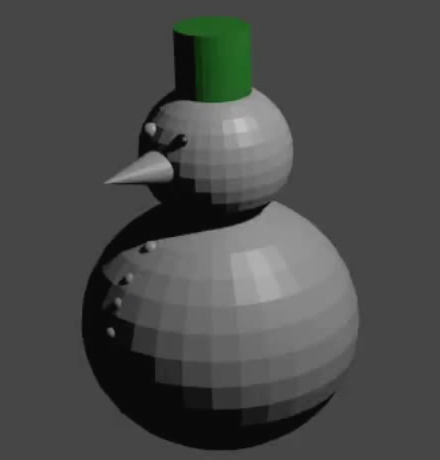

## Färbe ein Auge

In diesem Schritt färben Sie ein Auge.

+ Select one of the eyes by clicking on it. Du kannst sicherstellen, dass das Auge ausgewählt ist, indem du überprüfst, ob es eine orangefarbene Linie um das Auge herum gibt.

+ As with the hat, go to the **Material Properties** tab on the right-hand panel and press **New** to create a new material for the eye.

+ Benenne dieses Material 'Kohle'.

+ Wähle darunter **Base Color**. Du wirst sehen, dass es kein Schwarz auf der Farbpalette gibt! Du kannst aber die Intensität verringern, indem du den Punkt rechts unten bewegst, bis du schwarz erreichst.

Jetzt hast du ein schwarzes Auge. Der Rest des Schneemanns ist noch grau.

+ Render das Bild, um zu sehen, wie es aussieht.

+ Drücke <kbd>ESC</kbd> um die Renderansicht erneut zu verlassen.