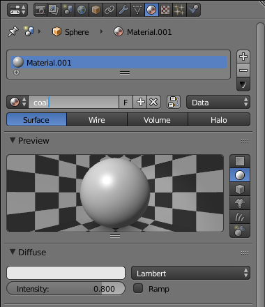
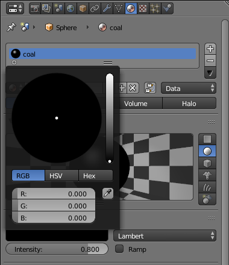

## Colour an eye

In this step, you'll be colouring an eye.

+ Select one of the eyes by clicking on it. You can make sure that the eye is selected by checking whether there's an orange border surrounding it.

+ As with the hat, go to the **Material Properties** tab on the right-hand panel and press **New** to create a new material for the eye.

+ Name this material 'coal'.

+ Underneath, select **Base Color**. You will see that there is no black on the colour palette! However, you can drop the intensity by moving the dot on the right down until you get to black.

So now you have a black eye. The rest of the snowman is still grey.

+ Render the image to see what it looks like.

+ Press <kbd>ESC</kbd> to exit the render view again.
