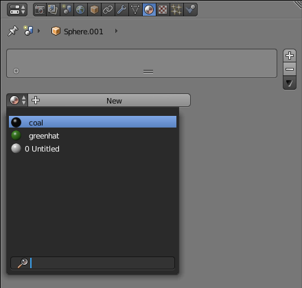
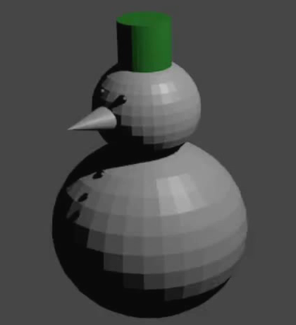

## Colour the eye and buttons

You could go through the whole process again of adding a new material each time to colour the other eye and each of the buttons, but this is quite cumbersome. It's much easier to reuse a material that you have already made, so let's reuse the coal material to colour the other eye and the buttons.

+ Select the other eye.

+ Go to the Material tab. Instead of pressing New, click on the **material selection drop down** next to New.

+ Select the coal material you created earlier.

Repeat this process for each of the snowman's buttons.

+ Select a button, then on the Material tab select the 'coal' material.

+ Press <kbd>F12</kbd> or <kbd>FN + F12</kbd> again. You will see that the snowman now has black buttons and black eyes.

