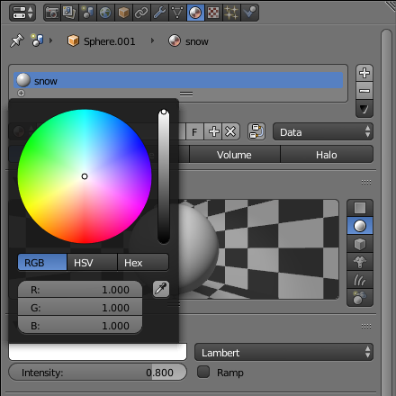

## Challenge: Colour the body

In your 3D scene you will notice that the spheres making up the bottom and the head of the snowman are grey and not white.

See if you can follow the same process to colour the snowman's head and body white.

+ To make the colour white, you need to drag the dot on the slider all the way to the top.

