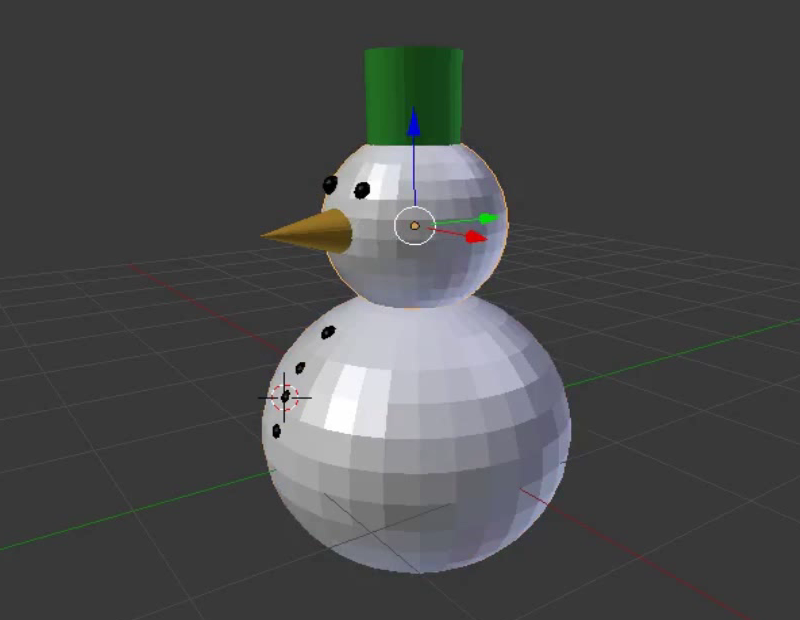

## Desafío: Colorea el cuerpo

Cuando estés en la vista 3D, notarás que las esferas que componen el cuerpo y la cabeza del muñeco de nieve son grises y no blancas.

+ Comprueba si puedes usar lo que has aprendido para colorear de blanco la cabeza y el cuerpo del muñeco de nieve.

Para obtener el color blanco, tienes que arrastrar el punto sobre la barra hasta la parte superior.

