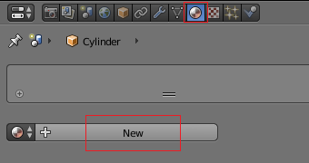
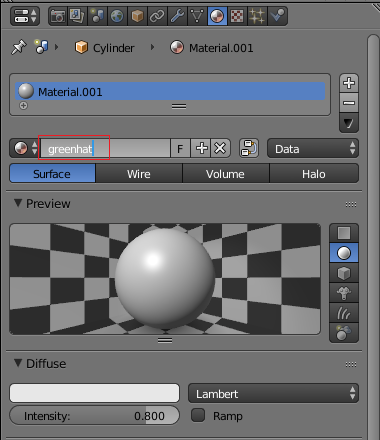
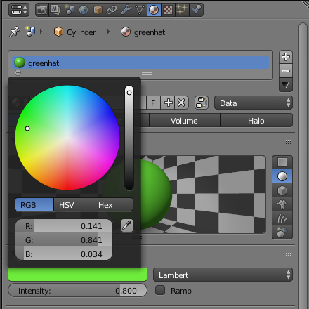
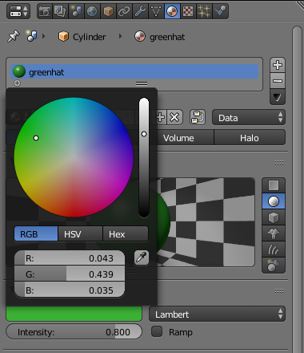

## Colour the hat

You will start with the snowman that you created if you have completed the [Snowman](https://projects.raspberrypi.org/en/projects/blender-snowman){:target="_blank"} resource. If you don't have a snowman, you can [download the starter project](resources/snowman.blend).

On its head, the snowman has a hat. Let's try and make it green.

+ Render the image by pressing <kbd>F12</kbd> (or <kbd>FN + F12</kbd> if you're working on a Mac).

If you look at what the camera sees, the snowman looks entirely grey. For example:

To colour the snowman, you need to add some **materials** to the model.

+ Press <kbd>ESC</kbd> to exit the render view.

+ Select the hat, then select the **Material** tab from the menu on the right-hand panel.

+ Add a new material by clicking the **New** button.

+ Name the material 'greenhat' by typing the name in the box.

+ Below, go to **Diffuse** and click on the white box. A colour palette will appear, where you can select a nice green colour.

The colour choices might look too bright green for your liking. If you would prefer a darker green, you can decrease the amount of intensity.

+ Select **Diffuse** again by clicking on the coloured box. Lower the dot in the right bar on the colour palette towards the black colour. You'll see the green getting darker.

+ Render your image to see what it looks like.

You can see that the snowman now has a green hat.

+ Exit the render view.

+ Use the middle mouse button to rotate the snowman — you'll see that the hat is green all the way around.