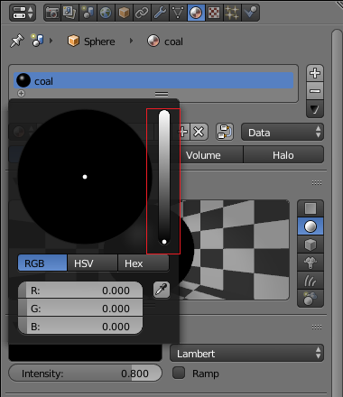

## एक आँख को रंग करें

इस चरण में, आप एक आँख को रंग करेंगे।

+ किसी एक आँख पर क्लिक करके उसका चयन करें। आँख का चयन हुआ है या नहीं इसे आप यह जाँच करके सुनिश्चित कर सकते हैं कि इसके चारों ओर नारंगी रंग का बॉर्डर है या नहीं।

+ टोपी के साथ, दाईं ओर के पैनल पर **Material Properties** टैब पर जाएँ और आँखों के लिए कोई नई सामग्री बनाने के लिए **New** दबाएँ।

+ इस सामग्री को 'coal' नाम दें।

+ नीचे, **Base Color** चुनें। आप देखेंगे कि रंग पैलेट पर कोई काला रंग नहीं है! हालांकि, आप दाईं ओर के डॉट को तब तक नीचे करते हुए उसकी तीव्रता को कम कर सकते हैं जब तक आपको काला रंग न मिल जाए।

तो अब आपके पास काले रंग की आँख है। बाकी का स्नोमैन अभी भी ग्रे रंग का है।

+ यह देखने के लिए छवि को प्रस्तुत करें कि यह कैसी दिखती है।

+ प्रस्तुत दृश्य से फिर से बाहर निकलने के लिए <kbd>ESC</kbd> दबाएँ।