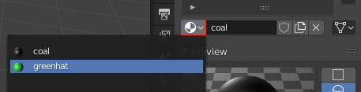

## Colour the eyes and buttons

To colour the other eye and each of the buttons, you could go through the whole process of adding a new material for each, but this would bequite cumbersome. It's much easier to reuse a material that you have already made, so let's reuse the coal material to colour the other eye and the buttons!

+ Select the other eye.

+ Go to the **Material** tab. Instead of selecting the **New** option, click on the **material selection** drop-down menu next to it.

+ Select the 'coal' material you created earlier.

Repeat this process for each of the snowman's buttons.

+ Select a button, then click on the **Material** tab to select the 'coal' material.

+ Render your image again. You will see that the snowman now has black buttons and black eyes.

