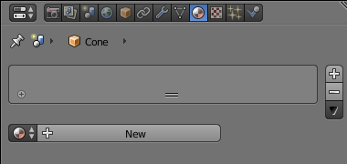
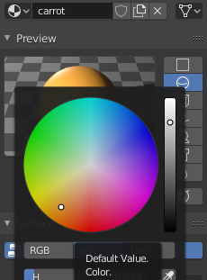

## Colour the nose

The snowman's nose will be orange. As you don't yet have an orange material, you will need to make a new colour.

+ Select the nose.

+ Go to the **Material** tab.

+ Select **New** to create a new colour.

+ Give the material a name, for example 'carrot'.

+ Select **Diffuse** and pick a nice orange colour. If necessary, drop the intensity to get a nice carrot-like shade.

+ Render your image to check that the nose has a nice orange colour.

+ Exit the render view again.