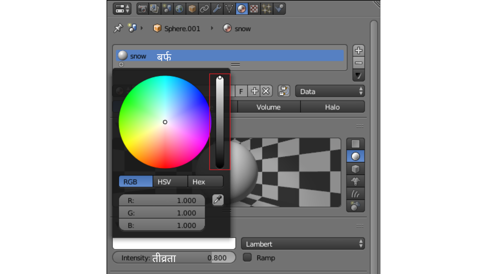

## Challenge: colour the body

When you're in 3D view, you will notice that the spheres making up the bottom and the head of the snowman are grey and not white.

+ See if you can use what you've learnt to colour the snowman's head and body white.

To make the colour white, you need to drag the dot on the slider all the way to the top.

